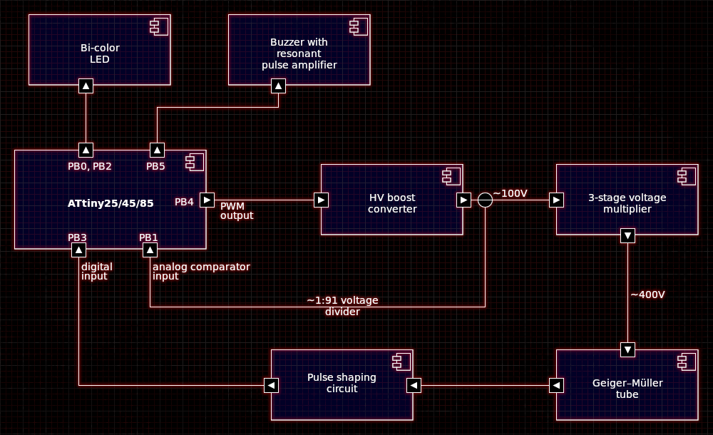
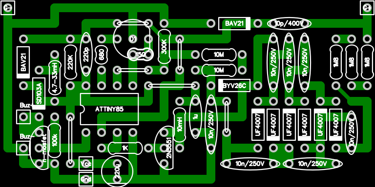

attiny85 sample apps and libraries
==================================

Introduction
------------

ATtiny85 MCU - some tests and example apps + I2C and LCD libraries

### Low power LED blink (lp_blink.c)

LED blink firmware putting the MCU into power-down state
between the LED changes.

### Charlie (charlie.c)

A simple demonstration of PWM LED charlieplexing.

### I2C LCD display demonstration (main.c)

MQ6 readout and a progress bar on a LCD. 

### MQ6 gas sensor demonstration (mq_6.c)

MQ6 readout and a progress bar on a LCD. 

### Annoyatron

A simple circuit making different noises at random
intervals when left in the dark. The sounds/noises are:

 - `snd/snd_cricket.c` - cricket chirp
 - `snd/snd_droplet.c` - leaking faucet
 - `snd/snd_insect.c` - buzzing insect
 - `snd/snd_scifi.c` - sci-fi/robot sounds
 - `snd/snd_water.c` - running water
 - `snd/snd_whisper.c` - scary whispers

Connections are simple:
 - PB1/PB4 - piezo buzzer
 - PB2 - LDR (light-dependent resistor) to VCC and a 47k resistor to GND


### Simple Geiger Counter firmware (geiger.c)


Simple Geiger Counter based on ATtinyx5 MCU.
This is more of a Geiger alarm.
Tracks the radiation dose internally, but only signals two
alarm levels on a two-color LED and produces sound clicks
if the alarm level is breached. It's also designed to
be very low-power (battery life test ongoing).
No schematic yet, but here is a block diagram
and a veroboard-style PCB (made with [VeroRoute](https://sourceforge.net/projects/veroroute/)).





The BJT transistor can also be MPSA42.
The buzzer MOSFET should preferably logic level.

The firmware is designed as a simple and lightweight
cooperative scheduler maintaining in every state
the lowest power level possible: 


### U8g2 SSD1306 i2c OLED display test

### U8g2 SSD1306 i2c OLED + DS3231 clock app


### Speech

Simple speech synthesis test app containing all the phrases needed
to implement a talking clock (and more).

### Candle

Simple, 2xLED candle simulation. Based on ATTINY13 code from [here](https://sourceforge.net/projects/avrcandle/).
Additionally supporting automatic turn on at night via LDR.

Configuring
-----------

```
cmake -DCMAKE_BUILD_TYPE=Release -DAVR_MCU=attiny85 \
      -DAVR_PROGRAMMER=avrisp -DAVR_PROGRAMMER_PORT=/dev/ttyACM0 \
      -DMCU_FREQ=8000000 -DCMAKE_TOOLCHAIN_FILE=../toolchain-avr-gcc.make ..

make -j
```


Contact
-------
If you have questions, contact Mariusz Ryndzionek at:

<mryndzionek@gmail.com>
